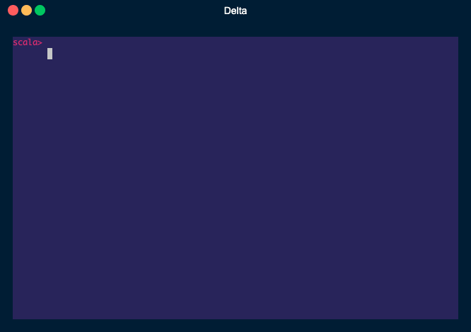
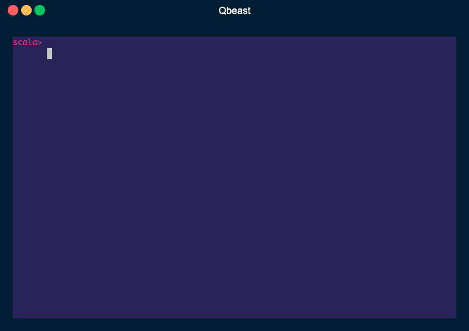

<p align="center">
	
</p>

<div align="center">


[](./docs)
[-ff7?style=for-the-badge&logo=readthedocs)](https://docs.qbeast.io/)
<br />
[](./docs/QbeastTable.md)
[](./docs/sample_pushdown_demo.ipynb)
<br />
[](https://join.slack.com/t/qbeast-users/shared_invite/zt-w0zy8qrm-tJ2di1kZpXhjDq_hAl1LHw)
[](https://qbeast.io/academy-courses-index/)
[![Website](https://img.shields.io/badge/_-Website-dc005f?style=for-the-badge&logo=data:image/png;base64,iVBORw0KGgoAAAANSUhEUgAAAE0AAABNCAMAAADU1xmCAAAABGdBTUEAALGPC/xhBQAAACBjSFJNAAB6JgAAgIQAAPoAAACA6AAAdTAAAOpgAAA6mAAAF3CculE8AAAC6FBMVEVHcEyCvU6qx1Ckx1CatGSNwk+qxlDmlouPuJHMwE/bvn7evU/geImbyVDxrDn2ulzjQYTkQYXjQYTjQYTjQYTjQYTjQYTjQYTjQYTjQYTjQYTjQYTeR4ihx1D3tlb3sUf4qkH3slbysETmQofjQYTjQYT3qjv2rk35u2LvwWr5t1r41JjjQYTjQYT5yJL6yIH6zIn83rL705j94rzjQYTjQYTKqpj337LjQYT3qFHkRYf847/lRYf95sX5slWd4dxZxrlCtp58vp2Yv5Kkp5G+up0Wt6k4uqlSvKfQ272o0YWt4NTTwVTa0IfjQYT72aP61KX1g7P6tdH0ibfzcaj6p8jzXZ36ncP7rs37utRNSX6mdqY3NnaVjJU8OndBQHlaVoHAtaVUUYBhXoRZVoJpZYVzbouHgJCNxE+eyFCqx1CzxFC6w1DEwVDMwE/Wvk/evVDpu1DjQYT4r034s1D4t1n5vWf5w3X6xn76yoX7z5H705n71Z7616P826z837T84bn848D958j+6dBfv6pzwKeBxKaPxqebyamkyqerzKezzKe7z6lKvKnd59ygzYWDvk/97daj1cPJ3813uE/+8uF1z8OBu5BusGtUpExor07+8Nv+9elfq4U3lU6sx1XB04Td163w37Ts8++ZymLl27HE0qnP1KvT1Kv++fH++vn3xc3drtH////5q273nk72ttPUnMn3pE74u9XJfLjRrc77za/75/LDdbb4qlD7wNj2xd29crXY1dHy8ub2lUzyr8+1bLLzrqn3qpL3moH2jGT1f0zzeEj0hEr1iEr1jUyvZrDzcU3yZ0fuqc3spMronsf31+jDgbPil8TekcGnX63Pg7rajcDVib6gXKzdn7CXVamJTKWhdbDJvs6sop3QqZShmJmmnZo+PHhhXYS0bLOknq+XkJack5exp55taYqRiJO3rKCBe4+JgZFKSHxSUH+yqcB8do2/s6NzbYp4cotaV4JoZIVjODowAAAAaHRSTlMAZfugL62AAyHGFtEH4HxyJl+Nrcnb4dK8onJIEVzEl2RFL1Tq/v7dpYZUOJj0IOi8jHZfHGoM5vn0M8M8qexNquLlz6du7f3538KNrumB27p+3I1wqlyWtOBK07r+mOAu39af/PbmWr6y1IwAAAABYktHRK0gYsIdAAAACXBIWXMAABYlAAAWJQFJUiTwAAAAB3RJTUUH5gMVDhs12bWt8QAAAAFvck5UAc+id5oAAAcCSURBVFjDrdh5XBRVHADwVx5jOMpeLHslyuxGwC6iDgtuhJWInWtadtCFWSndrrcdCmgiECW4ooblkRarA4gCIZCkqOWVZiomooZRaQoe6b+992Zn9piZBXN/f/GB3S/v+L3fOwC4xbhjambmnb16gyBFn8zMN996uy8RHK0f1t65KyQ4XC+svds/OFxvVnuvPxkUbgCrvT8wOF11a9OC0te+nBb6P74skyuUqjC1Wh2u0er0BgDu5rRBgs9GDBw8JFKyySSlNTp8wqSS8do0wTzcA2P69BlRg+6NDo2J9WVlZotDEGrCo8X5a5FRWJs5c9asWbNnz5k7ND5+2PARsXEEoLUmh0moJXjGTagBa4SPNnfevA8+/OjjjxPjDOG8kBSu0ig1KjXEjSTow2tWgUaAwSNFtPmJIYYwJBm1lIxblKQtgQLWTE6LEh3ryCgRbcF9JB2WpE0WVhFei5CYuggRLet+QBtQ460h/dwRYiWBdQCvDZFKhZgUoZY9DFKjHngQxkMoRo8enZo6hq1ISOsPKJu4RsQNEmo5I0alpaWNfXjhokWfLM7NXZKXX/DIo1N5LZIIs0hxZLRAy855LG3s2E8XYm0x1AoKP/uc16IBBedIJsGBmKECbWmRR1tSXJi3bBmvPU4AFUpmg9TgxcULNOdyqJUszi3Kyy1ZsXLVKl6DGIkTUiNZ08lof+2L0uWwbau/RLHSS3siOhYAWo04nXTBGDLUT3OWLkQ9XY0wTvtqzdp1iYiToXVskRg6QNAgJN5fW8+OW0nJilVI+3rNmrUbNqyDHFylFO6rhGYwJgBiuJ8GOW5O8/MLNn7z7VqsrUsMhctUizi9uGZ3OOSAiB3nq5UV8lrBRo+2YFws+v9QCxfFrPBPJjmc2yd9NVexmJaVNRIurQTJxslRbdXCgjt+03wfbXORUHMy5RVRJCDRvCrFNJSNDhmwySdUblrgo20p8tOWMoyzoqIqlG1cEi3EaHaCCOqprZWVrhxvbVt1rreW7WIYpgZqKSQwoCyRCzU8BHIQR02AWi3j9Na+25zLaxvKGBTlUKsbzE6rSFeVqM1WkPz0dqjVM0xZjpfW0Mhp32OLKd2BNLgJ6lEGC5eXkc1EaiLSmtA3nF5aQyPWChl31GBteggwoK3IJjpsdjijE7BWi75S5qX9UJyXX+xi2+XMySpntRh28gQDp2czx/rMdqzV4++5Sp281tBYs3NXc/PuPXv3/PjTvh2sBvcGM/yeQnQSZMA6ntWa6mtxQ8p4bX/DgYMwDuz11uDA6cSmwY40AhiedWuHfj586AgEXby2/5cDAi2F7ZTKX1OgzROuvIke7fDRo79W1rp47dhxgTYDABv8Ypi/hrqvhtpzvtqJlpYtLZx28reDB/f6agSQsc3oqXZ8G6+d2unfNgIng0Wqp4G1U7sEmk1Ms7O/9B83f+1Us/+4JbOdEskQg8+cimmtJ5v95pQSK5i4xts8+SbVttbTuzmtDuebXWxvsLElhERrYesR6ba1tlbvZrWaeXgtoCJiFmymSfi3BPX89q0ul6R2uq3tzNl9UKvIZsrxOlWLbqoqNgvTX4DFjWlqqqwUaseq286c+/0M5PaVO5kyXENQujmExzyFe6G2n29DmuuIn/ZHdVvHn3+dQ9rfZ3fBNZeD6xsu5cJbkp4tSeDF9vYLhfUuptZH29LWcfHiS5z2TyMqcVV17oIkskGTFnyAB+ntMDrWMy6P1lLdcenyZW8NcXOqUth1JXoWwRs3hRvX3tl1hdNOVF+5evWSv3atkKmrcm8LJpE9Cyc1ykPUuM7OzgvHkbb5ytXr1/8V0a7loP2UhplgEj+JhLMpB15GWGfXjdOwVTdvXpDQrqG9PsBBBC8HI1xdryCuq+vGjfPnA2hj3N1RSRyS8G6vBSCjswfaJHjcDwtwRmL/FeprevfapBB3P5WSZ0tUMh3o3J7enTapn7vsWGhJzYqPsujcnt4VUEMYZWIvhdJhS8KXUMhlvBpAS4XnSiopcD+5QxxsHewsOfk1KW0Mqq7s5dUc+B5vZ6+kqAMZk0W1VNhL0sxdXnWBOffnlDT2XvfXkAVsnquwiQrMKdiPWXSozpDpk9/waKlT0H3ZYPa+oktd3bjQ4Q+bHGqdFV3AgCFjCooM9hGBViT5XvWNdGBOz71bWLR60utiB2G5Rvh0EG4IzNEazxOBRiFPltEG2qZPMIeLvEKgItLdcxylFn7J60et3edP5u5efEid0SERJqWNy6Qe5gl+99GIdUytkHlnUs/yBI+7Qa706bFFY+c3O0LpuIU84W+GyVSCHYZOrqd9RpvU3EqedD8UKp88ud2HPa+3JodJd7ua+2qPLGNyEJ4dZe400tAgGGHDL36KIL1Ng2SLw+JOtv8Aax/72g6rujwAAAAldEVYdGRhdGU6Y3JlYXRlADIwMjItMDMtMjFUMTQ6Mjc6NTArMDA6MDBUKA+xAAAAJXRFWHRkYXRlOm1vZGlmeQAyMDIyLTAzLTIxVDE0OjI3OjUwKzAwOjAwJXW3DQAAAABJRU5ErkJggg==)](https://qbeast.io)

---

**Qbeast Spark** is an Apache Spark extension that enhances data processing in [**Data Lakehouses**](http://cidrdb.org/cidr2021/papers/cidr2021_paper17.pdf). It provides advanced **multi-dimensional filtering** and **efficient data sampling**, enabling faster and more accurate queries. The extension also maintains ACID properties for data integrity and reliability, making it ideal for handling large-scale data efficiently.

[](https://spark.apache.org/releases/spark-release-3-5-0.html) 
[](https://hadoop.apache.org/release/3.3.1.html)
[](https://github.com/delta-io/delta/releases/tag/v2.4.0)
[](https://codecov.io/gh/Qbeast-io/qbeast-spark)

</div>

## Features

1. **Data Lakehouse** - Data lake with **ACID** properties, thanks to the underlying [Delta Lake](https://delta.io/) architecture


2. **Multi-column indexing**:  **Filter** your data with **multiple columns** using the Qbeast Format.
   

3. **Improved Sampling operator** - **Read** statistically significant **subsets** of files.
   

4. **Table Tolerance** - Model for sampling fraction and **query accuracy** trade-off. 


## Query example with Qbeast

|  |  |
|:---------------------------------------------------------------:|:---------------------------------------------------------------:|

As you can see above, the Qbeast Spark extension allows **faster** queries with statistically **accurate** sampling.

| Format | Execution Time |   Result  |
|--------|:--------------:|:---------:|
| Delta  |  ~ 151.3 sec.  | 37.869383 |
| Qbeast |   ~ 6.6 sec.   | 37.856333 |

In this example, **1% sampling** provides the result **x22 times faster** compared to using Delta format, with an **error of 0,034%**.

## Documentation
Explore the documentation for more details:
- [Quickstart for Qbeast-Spark](./docs/Quickstart.md)
- [Data Lakehouse with Qbeast Format](./docs/QbeastFormat.md)
- [OTree Algorithm](./docs/OTreeAlgorithm.md)
- [QbeastTable](./docs/QbeastTable.md)
- [Columns To Index Selector](./docs/ColumnsToIndexSelector.md)
- [Recommendations for different Cloud Storage systems](./docs/CloudStorages.md)
- [Advanced configurations](./docs/AdvancedConfiguration.md)
- [Qbeast Metadata](./docs/QbeastFormat.md)
- [FAQ: Frequently Asked Questions](./docs/FAQ.md)

# Quickstart
You can run the qbeast-spark application locally on your computer, or using a Docker image we already prepared with the dependencies.
You can find it in the [Packages section](https://github.com/orgs/Qbeast-io/packages?repo_name=qbeast-spark).

### Pre: Install **Spark**
Download **Spark 3.5.0 with Hadoop 3.3.4**, unzip it, and create the `SPARK_HOME` environment variable:<br />

>:information_source: **Note**: You can use Hadoop 2.7 if desired, but you could have some troubles with different cloud providers' storage, read more about it [here](docs/CloudStorages.md).

```bash
wget https://archive.apache.org/dist/spark/spark-3.5.0/spark-3.5.0-bin-hadoop3.tgz

tar -xzvf spark-3.5.0-bin-hadoop3.tgz

export SPARK_HOME=$PWD/spark-3.5.0-bin-hadoop3
 ```
### 1. Launch a spark-shell

**Inside the project folder**, launch a **spark shell** with the required dependencies:

```bash
$SPARK_HOME/bin/spark-shell \
--packages io.qbeast:qbeast-spark_2.12:0.7.0,io.delta:delta-spark_2.12:3.1.0 \
--conf spark.sql.extensions=io.qbeast.spark.internal.QbeastSparkSessionExtension \
--conf spark.sql.catalog.spark_catalog=io.qbeast.spark.internal.sources.catalog.QbeastCatalog
```

### 2. Indexing a dataset

**Read** the **CSV** source file placed inside the project.

```scala
val csvDF = spark.read.format("csv").
  option("header", "true").
  option("inferSchema", "true").
  load("./src/test/resources/ecommerce100K_2019_Oct.csv")
```

Indexing the dataset by writing it into the **qbeast** format, specifying the columns to index.

```scala
val tmpDir = "/tmp/qbeast-spark"

csvDF.write.
  mode("overwrite").
  format("qbeast").
  option("columnsToIndex", "user_id,product_id").
  save(tmpDir)
```

#### SQL Syntax.
You can create a table with Qbeast with the help of `QbeastCatalog`.

```scala
spark.sql(
  "CREATE TABLE student (id INT, name STRING, age INT) " +
    "USING qbeast OPTIONS ('columnsToIndex'='id')")

```

Use **`INSERT INTO`** to add records to the new table. It will update the index in a **dynamic** fashion when new data is inserted.

```scala
val studentsDF = Seq((1, "Alice", 34), (2, "Bob", 36)).toDF("id", "name", "age")

studentsDF.write.mode("overwrite").saveAsTable("visitor_students")

// AS SELECT FROM
spark.sql("INSERT INTO table student SELECT * FROM visitor_students")

// VALUES
spark.sql("INSERT INTO table student VALUES (3, 'Charlie', 37)")

// SHOW
spark.sql("SELECT * FROM student").show()
+---+-------+---+
| id|   name|age|
+---+-------+---+
|  1|  Alice| 34| 
|  2|    Bob| 36|
|  3|Charlie| 37|
+---+-------+---+
```

###  3. Load the dataset
Load the newly indexed dataset.
```scala
val qbeastDF =
  spark.
    read.
    format("qbeast").
    load(tmpDir)
```

### 4. Examine the Query plan for sampling
**Sampling the data**, notice how the sampler is converted into filters and pushed down to the source!

```scala
qbeastDF.sample(0.1).explain(true)
```
Go to the [Quickstart](./docs/Quickstart.md) or [notebook](docs/sample_pushdown_demo.ipynb) for more details.

### 5. Interact with the format

Get **insights** to the data using the `QbeastTable` interface!

```scala
import io.qbeast.spark.QbeastTable

val qbeastTable = QbeastTable.forPath(spark, tmpDir) 

qbeastTable.getIndexMetrics()

```

### 6. Optimize the table

**Optimize** is an expensive operation that consist on **rewriting part of the files** to accomplish **better layout** and **improving query performance**.

To minimize write amplification of this command, **we execute it based on subsets of the table**, like `Revision ID's` or specific files.

> Read more about `Revision` and find an example [here](./docs/QbeastFormat.md).

#### Optimize API
These are the 3 ways of executing the `optimize` operation:

```scala
qbeastTable.optimize() // Optimizes the last Revision Available.
// This does NOT include previous Revision's optimizations.

qbeastTable.optimize(2L) // Optimizes the Revision number 2.

qbeastTable.optimize(Seq("file1", "file2")) // Optimizes the specific files
```

**If you want to optimize the full table, you must loop through `revisions`**:

```scala
val revisions = qbeastTable.revisionsIDs() // Get all the Revision ID's available in the table.
revisions.foreach(revision => 
  qbeastTable.optimize(revision)
)
```

Go to [QbeastTable documentation](./docs/QbeastTable.md) for more detailed information.

### 7. Visualize index
Use [Python index visualizer](./utils/visualizer/README.md) for your indexed table to visually examine index structure and gather sampling metrics.

# Dependencies and Version Compatibility
| Version |   Spark   |  Hadoop   | Delta Lake |
|-------|:---------:|:---------:|:----------:|
| 0.1.0 |   3.0.0   |   3.2.0   |   0.8.0    |
| 0.2.0 |   3.1.x   |   3.2.0   |   1.0.0    |
| 0.3.x |   3.2.x   |   3.3.x   |   1.2.x    |
| 0.4.x |   3.3.x   |   3.3.x   |   2.1.x    |
| 0.5.x |   3.4.x   |   3.3.x   |   2.4.x    |
| 0.6.x |   3.5.x   |   3.3.x   |   3.1.x    |
| **0.7.x** | **3.5.x** | **3.3.x** | **3.1.x**  |


Check [here](https://docs.delta.io/latest/releases.html) for **Delta Lake** and **Apache Spark** version compatibility.

# Contribution Guide

See [Contribution Guide](./CONTRIBUTING.md) for more information. 

# License
See [LICENSE](./LICENSE).

# Code of conduct

See [Code of conduct](./CODE_OF_CONDUCT.md)
