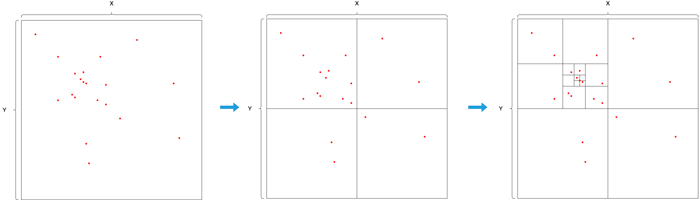
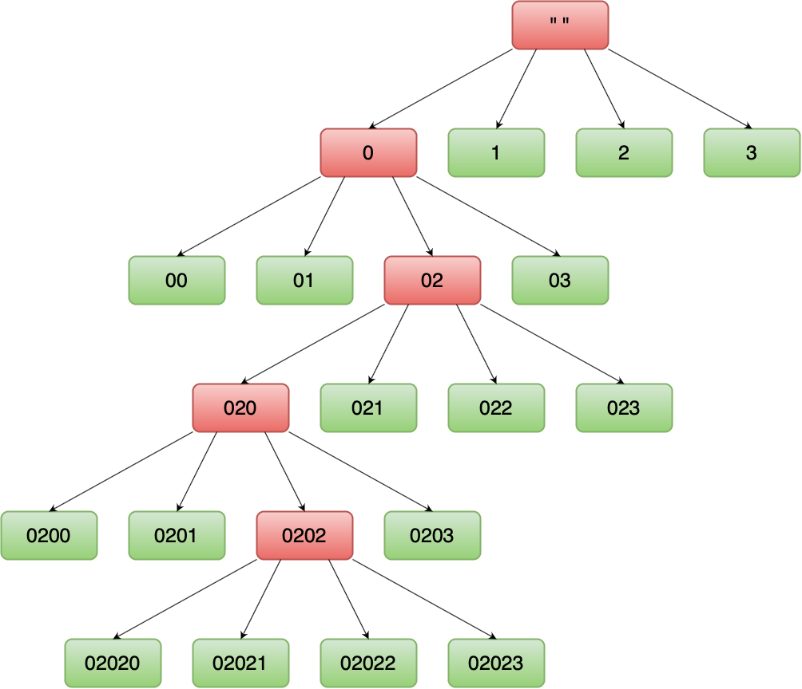
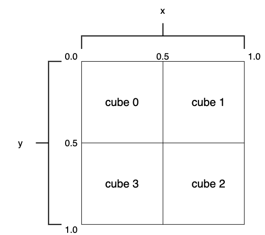
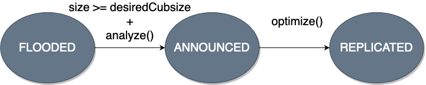

# OTree Algorithm

## Introduction
The two primary goals of the **OTree algorithm** are 
  1) enable spatial datasets with **multi-dimensional indexing** and
  2) empower the query engine with **optimized sampling operators**, that is, the ability to retrieve a **statistically significant** fraction of the dataset without reading all the data.

### Recursive Space Division
One of the most important techniques used to build a **multi-dimensional index** is through **recursive space division**; a bounded vector space initially containing all the data is **recursively divided** into **equal-sized**, **non-overlapping** subspaces, as long as they exceed the predefined **capacity**.

For a dataset indexed with `n` columns, the constructed index is an n-dimensional vector space composed of  subspaces, or what we call `cubes`, with **non-overlapping** boundaries. Each cube can contain a predefined number of element `cap`, and exceeding it would trigger **recursively dividing** a cube into child cubes by halving the ranges in all dimensions until the number of elements included no longer exceeds `cap`.

Say that we use two columns, `x`, and `y` to build the index, and the parameter cap for each cube is 2. The first image in the figure below is the **root cube**, containing more than two elements. The cube is split into four **equal-sized**, **non-overlapping** child cubes with one space division step, as shown in the middle image. Three of the four cubes are in good condition as a result of the division.

The process doesn't end here. The algorithm would keep splitting the space for the **top-left** cube until meeting the condition `size ≤ cap` for all cubes. In this particular case, it took four more divisions to finish. The third image shows the final result.

The figure below shows a treelike representation of the above example. Each square represents a cube, with green cubes that satisfy the requirement `size ≤ cap` and red ones that don't.

As stated earlier, all cubes have bounded values for the indexed columns, and they dictate the elements they can store. If we were to query a dataset and select a set of elements that fall inside the boundaries of cube `020`, then all subsequent cubes `0200`, `0201`, `0203`, `02020`, `02021`, `02022`, and `02023` are to be consulted and read.

It is worth mentioning that each time we divide a cube, the cube itself would no longer hold the data but have it distributed among its child cubes. We store no actual data but their **pointers** in the index.

### Efficient Data Sampling
A sample operator, present in many **query engines**, can retrieve a **randomly** generated subset of data from the original dataset. In the era of massive datasets, the I/O involved in reading the entire TB or PB of data is both computationally expensive and time-consuming. Fortunately, one does not need all the data for many analytical workloads, and a **statistically representative** subset usually can do the trick.

However, although the result of a sample operation is a subset of the desired size, the price for generating such a subset is generally **not** lower - we first load **the entire dataset** into memory, and only then a random selection is used for the subset generation.

## OTree "Index"
Built on top of a recursive space division algorithm, the OTree "Index" adopts a **data denormalization** methodology to empower both **multi-dimensional indexing** and **efficient data sampling** at the same time. It arranges the data and its **replicas** in a multi-dimensional tree, with no need for a separate structure for the index, for the architecture of the **data arrangement** itself already plays the role.

In a nutshell, we distribute our data and replicas among a **multi-dimensional** tree, where each cube gets to have a random subset of it. We can access this fraction through a parameter called `maxWeight`, and all cubes also have one of the three possible **states** that determine their **READ** and **WRITE** protocols.

In this case, all cubes store **actual** data and don't use pointers.

The rest of the page describes the theoretical details about the OTree, including cube states and their READ and WRITE protocols, how data replication is conducted.

### Terminologies
- `cube`: similar to a node in a tree data structure, except it defines a confined **n-dimensional** space, with `n` being the number of indexed columns.
  

- `payload`: elements stored in a cube that won't be cut off after **replication**

  
- `offset`: where the excess elements are stored for cubes with `size ≥ desired_capacity`.

  
- `desiredCubeSize`: the capacity of the `payload`.

  
- `size`: the number of total elements currently contained in a cube(payload + offset)

  
- `weight`: random integer value from [Int.MinValue, Int.MaxValue] assigned to new elements upon writing. Weights have a uniform distribution.

  
- `maxWeight`: the largest `weight` from all elements contained in a cube's `payload`. They are the fraction of the dataset in each cube, and by design, are arranged in a **non-decreasing** order traversing the tree from top to bottom.

  
- `maxElement`: the element in the payload associated with the `maxWeight`. More than one element may have the `weight = maxWeight`, but only one can be the `maxElement`.
  

- `indexedColumns`: columns from the dataset used to construct the index

### General READ protocol
- Sample fraction `f` from `df.sample(f)` is the target sample size. A list of cubes that make up the fraction is constructed by analyzing the tree.

- **READ**s start from the **root** and traverses the tree in a **DFS** fashion, prioritizing children over siblings.

- The traversal ceases going downwards once a cube with `maxWeight > f` is encountered.

- Sibling cubes from the current level are examined to determine their candidacy for the list.

- whether a cube is to be included and what part of it should be read is determined by its **state** and the relationship between `f` and `maxWeight`

- The protocol ends by reading all cubes from the list.

### General WRITE protocol
- Write an element `E(a, b | w)` to the tree, with `(a, b)` being the values of the element for indexed columns `(x, y)`, and `w` the randomly assigned `weight`.
  

- From the **root**, find the proper cube among `cube 0`, `cube 1`, `cube 2`, and `cube 3` for `E` according to its values `(a, b)`. Say that columns `x`, and `y` both have the range [0.0, 1.0], and `(a, b) = (0.1, 0.2)`. In this case, `cube 0` is the cube of choice.

  

- Proceed to conduct the WRITE according to the WRITE protocol of the cube:
    - `maxWeight > w`: write `E` according to the WRITE protocol of the cube dictated by its state. The `maxWeight` defines the fraction of the dataset contained in the cube. Writing a new element to a full cube entails pushing the `maxElement` to the offset and update the `maxWeight`.
    - `maxWeight <= w`: go to the correct child cube among `cube 00`, `cube 01`, `cube 02`, and `cube 03`, and recheck the condition.
    

- Unlike the traditional space division algorithm, we don't split the cube immediately when exceeding the capacity during writes. The **optimization** of the cube, and the index in general, is handled by a separate procedure.

### States
The state of a cube dictates, among other things, its **READ** and **WRITE** protocol and whether replication of its contained elements exists among its subtree.

The following image depicts the three possible states, and whether a cube is of one state or another depends on the following factors:
  - `size/desiredCubeSize` ratio
  - the state of its ancestors
  - whether `analyze()` or `optimize()` is called

  

- FLOODED

  This is the initial state of the cube. The protocol is separated into two cases.
  - `size <= desiredCubeSize`:
    `maxWeight` is set to `Int.Maxvalue`
    - READ: read elements from the `payload` with `weight <= f`
    - WRITE: write to the `payload`

  - `size > desiredCubeSize`:
    - READ:
      - `f >= maxWeight`: read the `payload + offset`      
      - `f < maxWeight`: read elements from the `payload` with `weight <= f`
    - WRITE:
      - write to the `payload`
  

- ANNOUNCED

  - WRITE: write to the `payload`, mark the new elements as `After Announcement(AA)`
  - READ:
    - `f >= maxWeight`: read the `payload + offset` excluding `AA` elements
    - `f < maxWeight`: read elements from the `payload` with `weight <= f`

- REPLICATED

  The final state of any cubes where all elements are replicated and distributed among their subtrees.
  - WRITE: write to `payload` and replicate the newly written element down the subtree
  - READ:
    - `f >= maxWeight`: don't read anything
    - `f < maxWeight`: read elements from the `payload` with `weight <= f`
    
