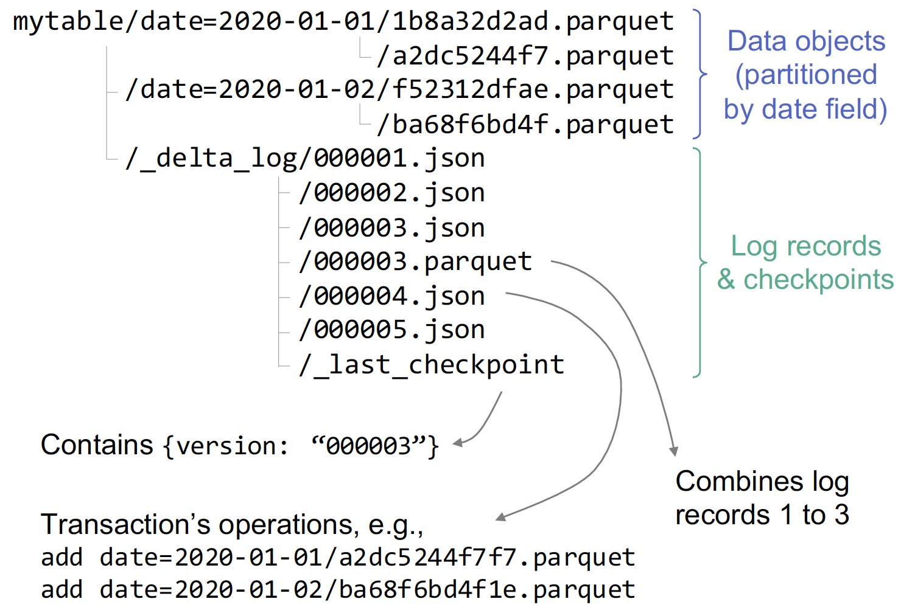

# Data Lakehouse with Qbeast Format

Based on Delta Lake transaction log protocol, we introduce some changes in order to enable **multi-dimensional indexing** and **efficient sampling** to the current implementation. 
## Lakehouse and Delta log
To address many issues with a two-tier **data lake + warehouse** architecture, open format storage layers such as **Delta Lake** use transaction logs on top of object stores for metadata management and to achieve primarily `ACID` properties and table versioning.

A **transaction log** in Delta Lake holds information about what objects comprise a table and is stored in the same object store and named as `_delta_log/`. Actions such as `Add` and `Remove` are stored in `JSON` or `parquet` files in chronological order and are consulted before any I/O operation to **reconstruct the latest state of the table**. The actual data objects are stored in `parquet` format.


<p align="center">
  
</p>


Following each write transaction is the creation of a new log file. **Table-level transaction atomicity** is achieved by following the `put-if-absent` protocol for log file naming - only one client can create a log file with a particular name when attempted by multiple users. Each action record in the log has a field `modificationTime` as **timestamp**, which forms the basis for `snapshot isolation` for read transactions. Check [here](https://github.com/delta-io/delta/blob/master/PROTOCOL.md) for more details about Delta Lake logs.

<br/>

## Qbeast-spark on Delta

### Changes on _delta_log/

> We are working on providing a **unified metadata structure** for Qbeast Format.
>
> Any feedback is welcome!

**Qbeast-spark** extends Delta Lake to enhance **Data Lakehouses** with functionalities such as `multi-dimensional indexing`, efficient `sampling`, `table tolerance`, etc., through modifying the log files on the **record level**. Each record's `tags` field has information that describes the `OTree`, `cube`, and `block` involved in the operation.

Before showing the changes, let's take a look on the components of the index.

### Components of the index

On a high level, the index consists of one or more `OTrees` that contain `cubes`(or nodes), and each cube is made of `blocks` that contain the actual data written by the user. All records from the log are of **block/file-level** information.

- `revision` locates the particular tree


- `cube` identifies the current `block`'s `cube` from the `tree`


- `state` of the `block` determines the **READ** and **WRITE** protocols


- `weightMax/weightMin`: Each element gets assigned with a uniformly created `weight` parameter. `weightMin` and `weightMax` define the range of weights that the `block` can contain.


- `transformations` inside `revision` consist of two maps(in this case), each corresponding to one of the `indexedColumns`. Each pair of `min`/`max` defines the range of values of the associated indexed column that the `tree` can contain and is to be expanded to accommodate new rows that fall outside the current range.

### AddFile changes

Here you can see the changes on the `AddFile` **`tags`** information
```json
{
  "add": {
    "path": "d54ba0cd-c315-4388-9bce-fe573f5d0a64.parquet",
    ...
    "tags": {
      "state": "FLOODED",
      "cube": "gw",
      "revision": "1",
      "elementCount": "10836",
      "minWeight": "-1253864150",
      "maxWeight": "1254740128"
    }
  }
}

```
- `cube` the serialized representation of the Cube
- `revision`: the metadata of the tree
- `elementCount`: the number of elements in the block
- `minWeight`: the minimum weight of the block
- `maxWeight`: the maximum weight of the block
### MetaData changes

And here the changes on `Metadata` `configuration` map

```json
{
  "metaData": {
    "id": "aa43874a-9688-4d14-8168-e16088641fdb",
    ...
    "configuration": {
      "qbeast.lastRevisionID": "1",
      "qbeast.revision.1": "{\"revisionID\":1,\"timestamp\":1637851757680,\"tableID\":\"/tmp/qb-testing1584592925006274975\",\"desiredCubeSize\":10000,\"columnTransformers\":..}"
    },
    "createdTime": 1637851765848
  }
}

```
We store two different values:
- A pointer to the last revision available `qbeast.lastRevisionID`
- The different characteristics of this revision (`qb.revision.1`). 

### Revision information

A more closer look to the `qb.revision.1`:

```json

{
  "revisionID":1,
  "timestamp":1637851757680,
  "tableID":"/tmp/qb-testing1584592925006274975",
  "desiredCubeSize":10000,
  "columnTransformers":[
    {
      "className":"io.qbeast.core.transform.LinearTransformer",
      "columnName":"user_id",
      "dataType":"IntegerDataType"
    },
    {
      "className":"io.qbeast.core.transform.LinearTransformer",
      "columnName":"product_id",
      "dataType":"IntegerDataType"
    }
  ],
  "transformations":[
    {
      "className":"io.qbeast.core.transform.LinearTransformation",
      "minNumber":315309190,
      "maxNumber":566280860,
      "nullValue":476392009,
      "orderedDataType":"IntegerDataType"
    },
    {
      "className":"io.qbeast.core.transform.LinearTransformation",
      "minNumber":1000978,
      "maxNumber":60500010,
      "nullValue":6437856,
      "orderedDataType":"IntegerDataType"}
  ]
}

```

In Revision, you can find different information about the tree status and configuration:

- `timestamp` the time when the revision was created
- `tableID` the identifier of the table that the revision belongs
- `desiredCubeSize` the cube size from the option `cubeSize`
- `columnTransformers` the metadata of the different columns indexed with the option `columnsToIndex`

    - `columnTransformers.columnName` the name of the column
    - `columnTransformers.dataType` the data type of the column
- `transformations` contains information about the **space** of the data indexed by column

    - `transformations.className` the name of the class that implements the transformation
    - `transformations.minNumber` the minimum value
    - `transformations.maxNumber` the maximum value
    - `transformations.nullValue` the value that represents the null in the space

In this case, we index columns `user_id` and `product_id` (which are both `Integers`) with a linear transformation. This means that they will not suffer any transformation besides the normalization.

### State changes in MetaData

**Data de-normalization** is a crucial component behind our multi-dimensional index. Instead of storing an index in a separate tree-like data structure, we reorganize the data and their replications in an `OTree`, whose **hierarchical structure** is the actual index.

We also store the `cube` state changes in the `_delta_log/`. During index optimization, affected `blocks` modify their states, and new `blocks` are added. Users can trigger the optimization process manually through `analyze()` and `optimize()` methods.

See [OTreeAlgorithm](./OTreeAlgorithm.md) or the [research paper](https://upcommons.upc.edu/bitstream/handle/2117/180358/The_OTree_for_IEEE_short_paper.pdf?sequence=1) for more details.

```scala
import io.qbeast.spark.table._

val dir = "path/to/mytable"
val qbeastTable = QbeastTable.forPath(spark, dir)

qbeastTable.analyze()

qbeastTable.optimize()
```

**Cubes** are analyzed, and their **states** are changed according to the relation between their `payload` and the number of elements they contain. `cube` state changes can be viewed reading the `metaData` on the last delta commit log:

```json
{"metaData":{
  "configuration":
  {
    ...
    "qbeast.replicatedSet.1":"[\"\",\"g\",\"gQ\"]"},
    ...
  }
}

```

In this case, some blocks from cubes `root`, `g` and `gQ` transformed to the state of `REPLICATED`. Corresponding actions such as `Add` and `Remove` are recorded in `_delta_log/`, with `revision` from the log shown here as their `timestamp`.
