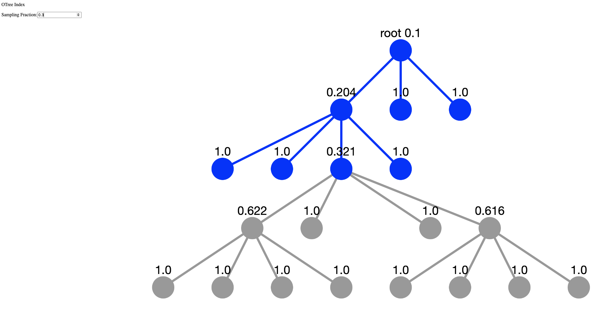

# OTree Index Visualizer
Python visualizer for qbeast index.

### Installation
```
git clone git@github.com:Qbeast-io/qbeast-spark.git

virtualenv ~/.envs/index-viz

source ~/.envs/index-viz/bin/activate

cd ./qbeast-spark/utils/visualizer/

make install
```
### Usage
```
qviz ./docs/test_table/

# optionally, specify the index revision(defaulted to 1)
# qviz <table-path> --revision-id=2
```
- Visualize cubes retrieved for a given sampling fraction.

- Sampling details: when a valid value for sampling fraction is given, a set of sampling metrics are displayed.
**Only the chosen revision is taken into account for computing sampling metrics.**
```
Sampling Info:
        Disclaimer:
                The displayed sampling metrics are valid only for single revision indexes(excluding revision 0):
        
        sample fraction: 0.3
        number of cubes read:8/20, 40.00%
        number of rows: 41858/100000, 41.86%
        sample size: 0.00141/0.00324GB, 43.49%
```
- To visualize any table, point to the folder in which the target `_delta_log/` is contained.
- To visualize a remote table, download its `_delta_log/` and point to the folder location.

### Tests
- To run all tests: `make test`
